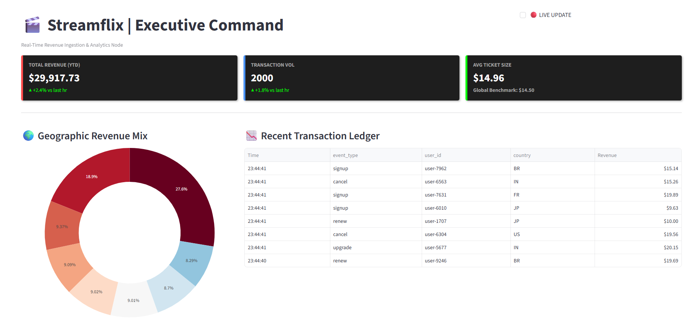
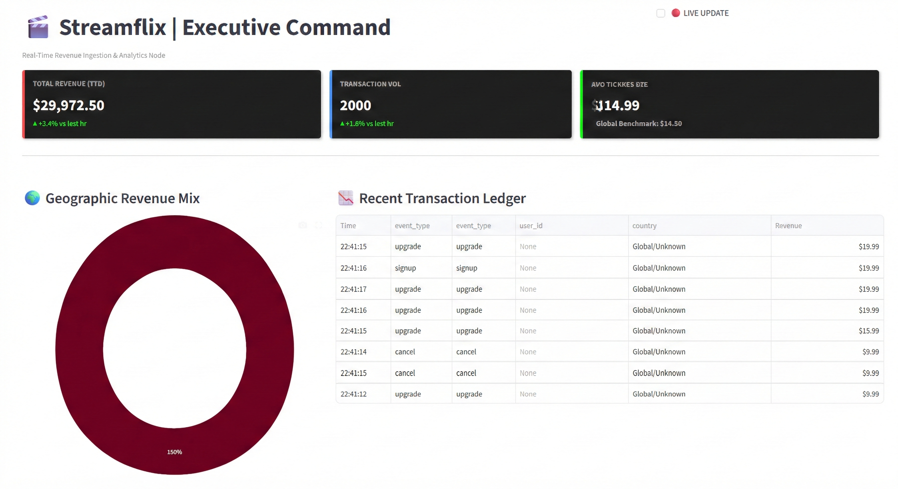

# 🎬 Streamflix: Real-Time Data Lakehouse



## 🚀 Overview
Streamflix is a production-grade **Real-Time Data Lakehouse** designed to ingest, process, and visualize high-throughput financial data. It simulates a global streaming platform (like Netflix), handling thousands of concurrent user events to calculate **Live Revenue**, **Churn**, and **ARPU** (Average Revenue Per User) with sub-second latency.

Unlike traditional batch pipelines that wait overnight to generate reports, Streamflix enables **ACID transactions on streaming data** using Apache Iceberg, allowing decision-makers to see the financial health of the business *as it happens*.

## 🏗️ Architecture
**Flow:** `Producer (Python)` -> `Redpanda (Kafka)` -> `Spark Structured Streaming` -> `Apache Iceberg` -> `MinIO (S3)` -> `Streamlit Dashboard`



* **Ingestion:** **Redpanda** (Kafka API) acts as the high-throughput message buffer.
* **Processing:** **Apache Spark Structured Streaming** handles micro-batch processing, schema enforcement, and data transformation.
* **Storage (The Lakehouse):** **Apache Iceberg** provides ACID compliance, time-travel, and schema evolution on top of raw object storage (**MinIO**).
* **Visualization:** A custom **Streamlit** executive dashboard queries the Data Lake in real-time.

## 🛠️ Tech Stack
* **Language:** Python (PySpark, Pandas)
* **Streaming:** Redpanda (Kafka)
* **Compute:** Apache Spark 3.5
* **Storage Format:** Apache Iceberg (Parquet)
* **Infrastructure:** Docker & Docker Compose

## 📊 Key Features
* **Strict Schema Enforcement:** Validates incoming JSON payloads to prevent "bad data" from corrupting the lake.
* **Exactly-Once Semantics:** Ensures every dollar is counted exactly once, even during system failures.
* **Executive Dashboard:** Live visualization of key financial metrics (Revenue, Geo-distribution, Transaction Feed).

## ⚡ How to Run
1.  **Clone the repo:**
    ```bash
    git clone [https://github.com/Mohit24-jpg/streamflix-revenue.git](https://github.com/Mohit24-jpg/streamflix-revenue.git)
    cd streamflix-revenue
    ```
2.  **Start Infrastructure:**
    ```bash
    docker-compose up -d
    ```
3.  **Initialize Data Lake (One time setup):**
    ```bash
    docker exec -it spark spark-submit --packages org.apache.spark:spark-sql-kafka-0-10_2.12:3.5.0,org.apache.iceberg:iceberg-spark-runtime-3.5_2.12:1.4.3,org.apache.hadoop:hadoop-aws:3.3.4 /home/jovyan/work/setup_table.py
    ```
4.  **Start the Pipeline:**
    ```bash
    # 1. Start Producer (Generates traffic)
    docker exec -it spark python /home/jovyan/work/producer.py
    
    # 2. Start Streaming Job
    docker exec -it spark spark-submit --properties-file /home/jovyan/work/spark.conf --packages org.apache.spark:spark-sql-kafka-0-10_2.12:3.5.0,org.apache.iceberg:iceberg-spark-runtime-3.5_2.12:1.4.3,org.apache.hadoop:hadoop-aws:3.3.4 /home/jovyan/work/ingest_job.py
    
    # 3. Launch Dashboard
    docker exec -it spark streamlit run /home/jovyan/work/dashboard.py
    ```
5.  **Access Dashboard:** Open `http://localhost:8501`
